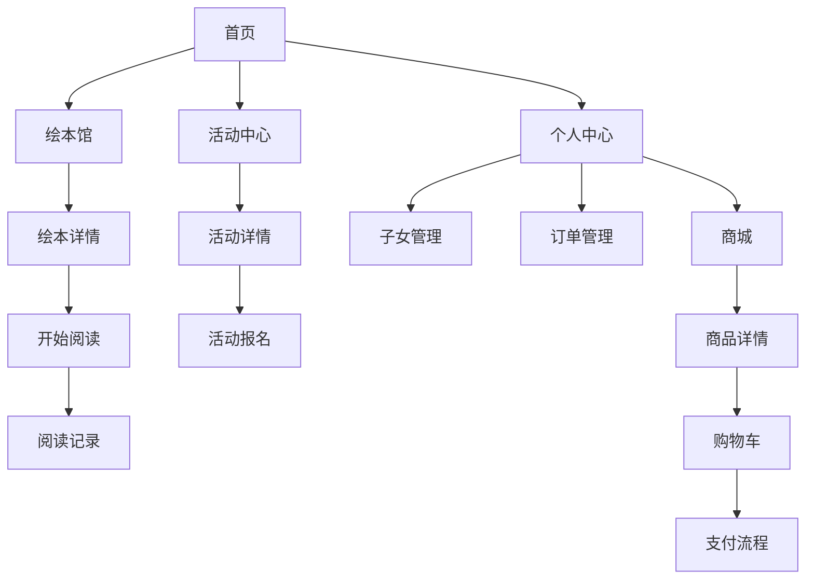

## 1. 产品概述
绘本岛是面向中国亲子家庭的绘本阅读+亲子活动综合平台，致力于为0-12岁儿童家长提供高质量的绘本内容和亲子活动服务。平台通过数字化阅读与线下活动相结合的方式，帮助家长提升亲子陪伴质量，促进家庭教育发展，打造温馨有趣的亲子互动体验。

## 2. 核心功能

### 2.1 用户角色
| 角色 | 注册方式 | 核心权限 |
|------|----------|----------|
| 家长用户 | 手机号注册/微信授权 | 浏览绘本、参与活动、购买商品、管理子女信息 |
| 平台管理员 | 后台创建 | 内容管理、用户管理、订单管理、数据分析 |
| 活动组织者 | 申请认证 | 发布活动、管理报名、与用户互动 |

### 2.2 功能模块
绘本岛平台包含以下核心页面：
1. **首页**：推荐绘本、热门活动、个性化内容展示
2. **绘本馆**：分类浏览、搜索筛选、详情阅读、收藏评论
3. **活动中心**：线下活动展示、报名管理、地区筛选
4. **阅读记录**：阅读足迹、打卡功能、成长记录
5. **个人中心**：用户信息、子女管理、订单管理、设置
6. **商城**：实体绘本、课程包购买、支付流程
7. **登录注册**：手机号注册、微信授权登录

### 2.3 页面详情
| 页面名称 | 模块名称 | 功能描述 |
|----------|----------|----------|
| 首页 | 轮播推荐 | 展示热门绘本、精选活动、限时优惠等内容，支持自动轮播和手动切换 |
| 首页 | 分类导航 | 提供绘本分类、活动类型、年龄段的快速入口 |
| 首页 | 个性化推荐 | 基于用户行为和子女信息推荐适合的绘本和活动 |
| 绘本馆 | 分类浏览 | 按年龄、主题、出版社等维度分类展示绘本 |
| 绘本馆 | 搜索筛选 | 支持关键词搜索、多条件筛选、排序功能 |
| 绘本馆 | 详情展示 | 展示绘本封面、简介、试读内容、用户评价 |
| 绘本馆 | 收藏评论 | 用户可收藏绘本、发表评论、查看他人评价 |
| 活动中心 | 活动列表 | 展示线下活动信息，支持地区筛选和分类浏览 |
| 活动中心 | 活动详情 | 展示活动时间、地点、费用、报名情况等详细信息 |
| 活动中心 | 报名管理 | 用户可报名参加活动，查看报名状态和历史记录 |
| 阅读记录 | 阅读足迹 | 记录用户阅读历史，展示阅读进度和时长 |
| 阅读记录 | 打卡功能 | 每日阅读打卡，连续打卡奖励机制 |
| 阅读记录 | 成长记录 | 生成阅读报告，展示阅读习惯和成长轨迹 |
| 个人中心 | 用户信息 | 显示用户基本信息，支持编辑修改 |
| 个人中心 | 子女管理 | 添加管理多个子女信息，包括年龄、兴趣等 |
| 个人中心 | 订单管理 | 查看购买记录、订单状态、物流信息 |
| 商城 | 商品展示 | 展示实体绘本、课程包等商品信息 |
| 商城 | 购物车 | 添加商品、数量调整、删除商品 |
| 商城 | 支付流程 | 支持多种支付方式，订单确认和支付完成 |
| 登录注册 | 手机号注册 | 手机号验证注册，设置密码 |
| 登录注册 | 微信授权 | 微信快捷登录，自动获取用户信息 |

## 3. 核心流程
### 用户主要操作流程：
1. 新用户通过手机号或微信注册登录
2. 完善个人信息和子女资料
3. 浏览绘本馆选择适合的绘本进行阅读
4. 参与感兴趣的线下亲子活动
5. 记录阅读足迹，进行每日打卡
6. 购买实体绘本或课程包
7. 查看个人中心管理订单和子女信息

## 4. 用户界面设计

### 4.1 设计风格
- **主色调**：温暖橙色(#FF8C42)搭配柔和蓝色(#4A90E2)，营造温馨童趣氛围
- **辅助色**：米白色(#FAF8F5)作为背景，深灰色(#333333)用于文字
- **按钮样式**：圆角矩形设计，采用渐变色彩，增加3D立体效果
- **字体选择**：主标题使用可爱圆润字体，正文使用清晰易读的无衬线字体
- **图标风格**：手绘风格图标，色彩丰富，符合儿童审美
- **布局风格**：卡片式布局，内容模块化，便于浏览和操作

### 4.2 页面设计
| 页面名称 | 模块名称 | UI元素 |
|----------|----------|----------|
| 首页 | 轮播推荐 | 全屏宽度轮播图，自动切换5秒间隔，底部指示器显示当前位置 |
| 首页 | 分类导航 | 2x4宫格布局，彩色图标+文字标签，点击有弹跳动画 |
| 绘本馆 | 分类浏览 | 左侧树形分类菜单，右侧卡片式绘本展示，每行2-3个 |
| 绘本详情 | 封面展示 | 大封面图居中，书名作者信息悬浮显示，支持放大查看 |
| 活动中心 | 活动列表 | 时间轴式布局，活动卡片按时间排序，显示报名状态标签 |
| 阅读记录 | 成长记录 | 数据可视化图表，使用可爱图标表示不同数据维度 |
| 个人中心 | 功能入口 | 列表式布局，图标+文字，右侧箭头指示，点击有反馈 |

### 4.3 响应式设计
- **移动端优先**：针对手机屏幕优化，触摸交互友好
- **平板适配**：横竖屏切换自适应，内容重新排布
- **桌面端支持**：大屏幕显示更多内容，支持鼠标悬停效果
- **断点设计**：320px、768px、1024px三个主要断点
- **触控优化**：按钮最小44px，支持手势操作

## 5. 技术要求

### 5.1 性能要求
- 页面加载时间不超过3秒
- 图片懒加载，支持WebP格式
- 资源压缩和CDN加速
- 本地缓存机制，减少重复请求

### 5.2 安全要求
- HTTPS加密传输
- 用户数据加密存储
- API接口权限验证
- 敏感信息脱敏处理

### 5.3 可扩展性
- 模块化架构设计
- 支持多语言扩展
- 功能插件化开发
- 数据库分库分表支持

## 6. 运营需求

### 6.1 内容管理
- 绘本内容审核机制
- 活动信息编辑发布
- 用户评论内容监管
- 推荐算法调优

### 6.2 数据分析
- 用户行为数据统计
- 阅读偏好分析
- 活动参与度统计
- 商业转化分析

### 6.3 营销工具
- 优惠券发放系统
- 会员积分体系
- 分享邀请机制
- 推送通知管理

### 6.4 客服系统
- 在线客服聊天
- 常见问题FAQ
- 用户反馈收集
- 投诉处理流程